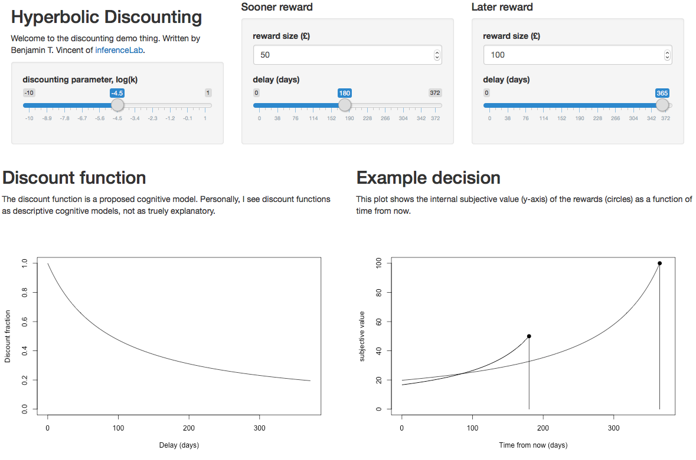

# discounting-visualizer

Made by Benjamin T. Vincent of [inferenceLab.com](https://www.inferencelab.com).

If you like this, then spread the word.
___

Here is a little interactive R / Shiny app I made to help visualize discount functions.

To run it, download the code and load up `app_hyperbolic/app.R` in RStudio, then click the "run app" Button. You should then see something like this.

Note that you can drag and drop the graphs (onto your desktop for example) in order to include them in any of your own documents.
